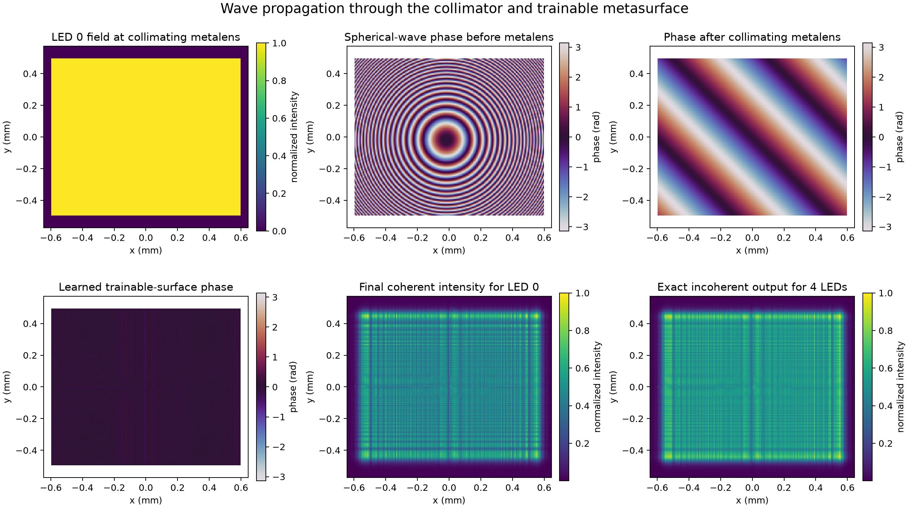
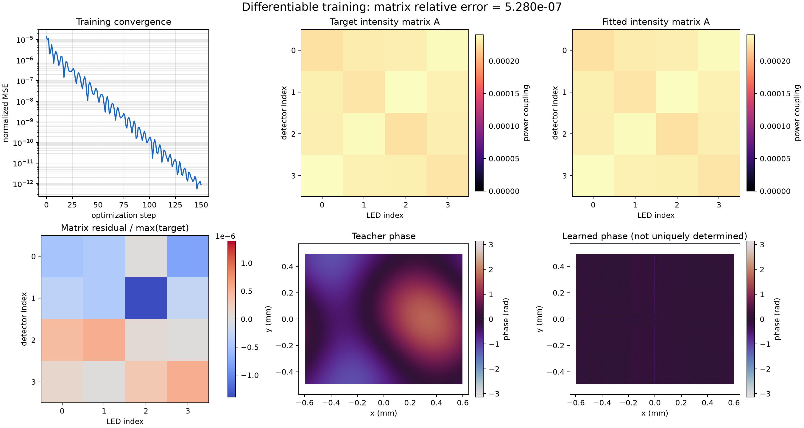
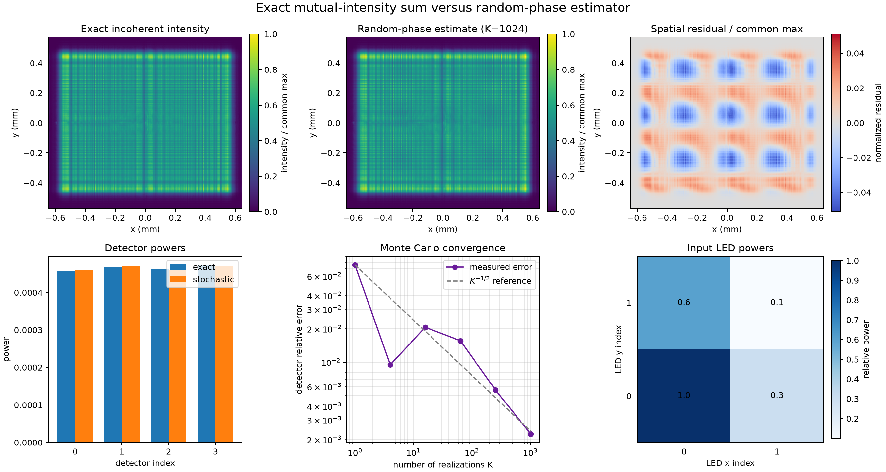

图1：一颗 LED 照射到第一层超表面（准直镜）的光强分布，外围为 0 是因为限制了矩形孔径，其透射函数在孔径外截断，此处孔径 / 焦距很小，光强可以采用均匀近似

图2：假设每颗 LED 只用一个理想发光点表示，作为单个相干空间模式产生球面波，经过准直镜之前的相位

图3：经过准直镜之后的相位，因 LED 不在正中心，是倾斜传播的平面波，所以有倾斜条纹

图4：面向 4x4 矩阵，端到端训练出的超表面相位，超表面有 32x32 个相位参数，初始化为 0，所以有很多 0 相位

图5：只点亮第一颗 LED，探测平面的强度分布，相当于 $M[1,0,0,0]^T$

图6：点亮四颗 LED，探测平面的强度分布，相当于 $M[1,0.3,0.6,0.1]^T$

---

图7 - 10：训练过程 MSE；LED 发射功率 -> 探测器接收功率传递矩阵的训练目标（因孔径很小，功率损失很多）；训练结果；二者之差

其中训练目标由图11：第二层超表面 $\displaystyle 0.8\sin\left(\frac{2\pi x}{W_x}\right) + 0.6\cos\left(\frac{2\pi y}{W_y}\right) + 0.3\sin\left(\frac{2\pi(x+y)}{W_x}\right)$ 产生

---

图 14： K=1024 的随机相位估计（蒙卡方法）得到的输出强度分布

图15 - 17：精确方法与蒙卡方法的误差（经过归一化），四个输出探测器的功率差，蒙卡收敛过程